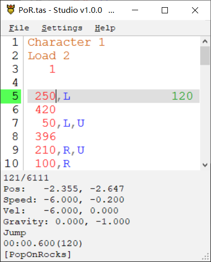

# SmolAme.YetAnotherTAS

Simple TAS Tools for the game [Smol Ame](https://moocow-games.itch.io/smol-ame).

## How to use

1. [Download](https://github.com/DemoJameson/SmolAme.YetAnotherTAS/releases) the zip then unzip all files into the game folder. ([SmolAme.Trainer](https://github.com/DemoJameson/SmolAme.Trainer) is already included in the zip file)
2. Run `Smol Ame.exe` will start the game with tas plugin now.
3. Press `F2` show settings.
4. Run `TAS.Stuido.exe` write tas. If the game does not respond when frame advancing,
you can still take control of the tas play in `TAS.Studio.exe`.

### Convert SmolTAS Input File
Just drag and drop the folder or file onto `TAS.Studio/SmolTAS.Converter.exe`.

### Known Issues
1. `Shuba` and `Reine` are easier desync than other characters, since their position will be slightly different each time the tas are played
2. `Red Heart` and `Mogu Mogu` might desync for unknown reason

## Input File
The input file is a text file with tas as an extension.

Format for the input file is `Frames,Actions`

e.g. `123,R,U` (For 123 frames, hold Right and Up)

## Actions Available
- L = Left
- R = Right
- U = Up or Jump
- D = Down
- E = ExitLevel
- S = RestartLevel
- C = Confirm
- P = Pause

## Special Input

### Breakpoints
- You can create a breakpoint in the input file by typing `***` by itself on a single line
- The program when played back from the start will fast forward until it reaches that line and then go into frame stepping mode
- You can specify the speed with `***X`, where `X` is the speedup factor. e.g. `***10` will go at 10x speed, `***0.5` will go at half speed.

### Commands
Various commands exist to facilitate TAS playback.

#### Repeat and EndRepeat
- Repeat the inputs between `Repeat` and `EndRepeat` several times, nesting is not supported.
- `Repeat, Count`
- `EndRepeat`

#### Read
- `Read, File Name, Starting Line, (Optional Ending Line)`
- Will read inputs from the specified file.
- If a custom path to read files from has been specified, it tries to find the file there. Otherwise, it will look for the file in the tas directory.
- e.g. `Read, 1A - Forsaken City.tas, 6` will read all inputs after line 6 from the `1A - Forsaken City.tas` file
- This will also work if you shorten the file name, i.e. `Read, 1A, 6` will do the same
- It's recommended to use labels instead of line numbers, so `Read, 1A, lvl_1` would be the preferred format for this example.

#### Play
- `Play, Starting Line, (Optional Frames to Wait)`
- A simplified `Read` command which skips to the starting line in the current file.
- Useful for splitting a large level into smaller chunks.

#### Labels
- Prefixing a line with `#` will comment out the line
- A line beginning with `#` can be also be used as the starting point or ending point of a Read instruction.
- You can comment highlighted text in TAS Studio by hitting `Ctrl+K`

#### FrameRate
- `FrameRate, integers greater than 0`
- Set the game's FPS

#### Seed
- `Seed, any string`
- Different seeds will produce different RNGs, you can use this command any time to change the subsequent RNGs, which only work on the current level

#### Load
- `Load, SceneName/ScendBuildIndex`
- `Load, SceneName/ScendBuildIndex, PositionX, PositionY`
- Loads the specified scene.

#### Teleport
- `Teleport, positionX, positionY`
- `Teleport, positionX, positionY, speedX, speedY`
- Teleport to the specified position and speed.

#### Character
- `Character, 1~12`
- Only works for smol ame v210305.1 and above

#### RecordCount
- e.g. `RecordCount: 1`
- Every time you run tas after modifying the current input file, the record count auto increases by one.

#### Time
- e.g. `Time: 0:49.334(2902)`
- After completing the level, auto updating the time.

## Playback of Input File
### Controller
While in game or TAS.Studio
- Playback/Stop: Right Stick
- Restart: Left Stick
- When Playing Back
    - Faster/Slower Playback: Right Stick X+/X-
    - Frame Step: DPad Up
    - While Frame Stepping:
        - One more frame: DPad Up
        - Continue at normal speed: DPad Down
        - Frame step continuously: Right Stick X+

### Keyboard
While in game or TAS.Studio
- Playback/Stop: RightControl
- Restart: =
- Faster/Slower Playback: RightShift / Alt+LeftShift
- Frame Step: [
- While Frame Stepping:
    - One more frame: [
    - Continue at normal speed: ]
    - Frame step continuously: RightShift

## TAS.Studio
Can be used instead of notepad or similar for easier editing of the TAS file. It is bundled with the TAS tools

### Controls
- Ctrl + Z: Undo
- Ctrl + Shift + Z: Redo
- Ctrl + O: Open File
- Alt + Left: Open Previous File
- Ctrl + Shift + S: Save As
- Ctrl + F: Find Text
- Ctrl + G: Go to Line/Label
- Ctrl + D: Toggle Sending Hotkeys to Game
- Ctrl + Shift + D: Refresh Connection Between Studio and Game
- Ctrl + Shift + C: Copy Player Data to Clipboard
- Ctrl + K: Block Comment/Uncomment (line by line processing)
- Ctrl + Shift + K: Block Comment/Uncomment
- Ctrl + P: Remove All Uncommented Breakpoints
- Ctrl + Shift + P: Remove All Breakpoints
- Ctrl + .: Insert/Remove Breakpoint
- Ctrl + R: Insert room name
- Ctrl + Shift + R: Insert Load Command at Current Level
- Ctrl + T: Insert Current in-game Time
- Ctrl + L: Combine Consecutive Same Inputs
- Ctrl + Shift + L: Force Combine Inputs Frames
- Ctrl + Down/Up: Go to Comment or Breakpoint
- Ctrl + Left Click on Read/Play Command: Open the read file / Go to the Play Line
- Right Click on Input Area: Show Input Context Menu
- Right Click on Info Area: Show Info Context Menu
- Shift + Mouse Wheel: Tweak Frames Between Selected Input and Mouse Pointed Input
- Ctrl + Shift + Up/Down: Tweak Frames Between Selected Inputs
- Ctrl + Alt + C: Copy File Path

## Credits
* [CelesteTAS-EverestInterop](https://github.com/EverestAPI/CelesteTAS-EverestInterop)
* [Smol-Ame-TAS-Inputs](https://github.com/Sh1r0Yaksha/Smol-Ame-TAS-Inputs)
